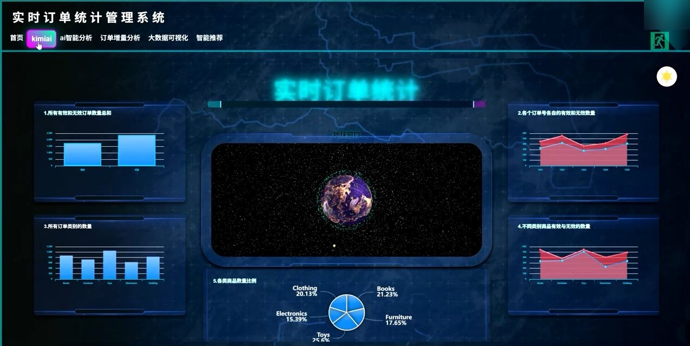
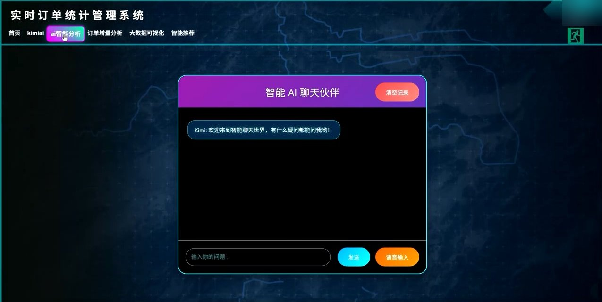
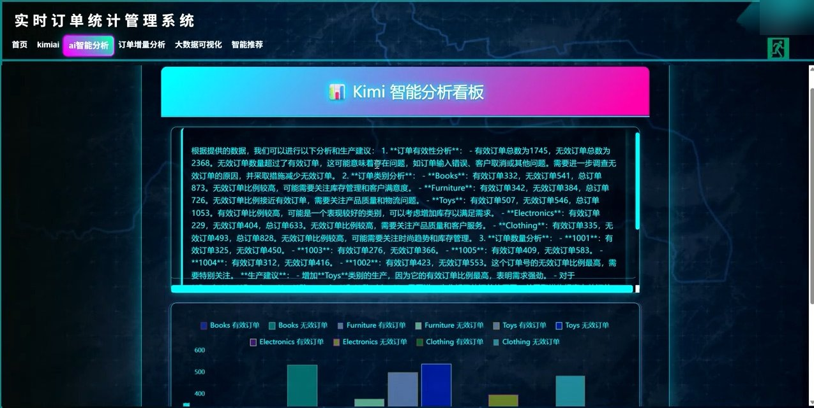
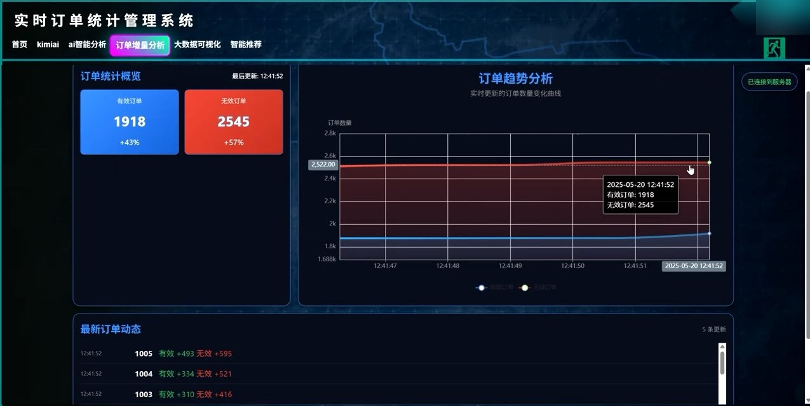
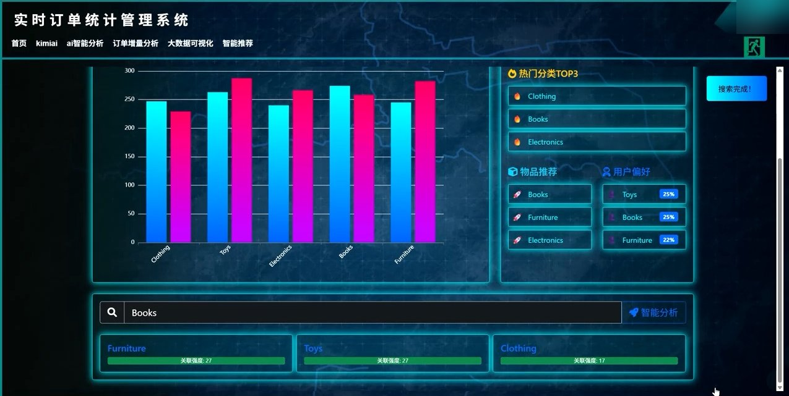

# 实时订单数据分析与推荐平台

> 基于大数据技术栈（Flume + Kafka + Spark Streaming + Sqoop + Hive + Flask）的电商订单实时处理与智能推荐系统。

---

## 一、项目概述

本项目模拟一个电商订单数据平台，完整覆盖大数据离线+实时两条链路：

- **数据采集**：Python 模拟订单数据源，通过 Kafka 上报
- **实时计算**：Spark Streaming 消费 Kafka，做窗口聚合统计，结果回写 Kafka
- **数据归档**：Flume 自定义 Source 消费 Kafka，落盘 HDFS
- **离线数仓**：Sqoop 将 MySQL 业务库同步到 Hive 中央仓库
- **Web 展示**：Flask + WebSocket + ECharts/Three.js 实时可视化 + Kimi AI 智能分析

---

## 二、整体数据流

```
                    ┌─────────────────────┐
                    │  producer.py        │  Python 模拟数据源（每 5 秒）
                    │  随机生成订单数据    │
                    └──────────┬──────────┘
                               │
              ┌────────────────┴────────────────┐
              ↓                                 ↓
     Kafka topic: "orders"              Kafka topic: "users"
     (基础订单数据)                      (订单 + user_id + rating)
              │                                 │
              │                    ┌────────────┴────────────┐
              │                    ↓                         ↓
              │          ① SparkStreaming.scala      ② Flume CustomSource
              │             (实时统计)                  (Java，日志归档)
              │                    │                         │
              │                    ↓                         ↓
              │      Kafka topic: "processed_orders"   HDFS
              │                    │                   hdfs://niit110:8020
              │                    ↓                   /flume/logs/%Y-%m-%d/%H
              │           Flask app.py 订阅
              │              ├─ WebSocket 推送前端
              │              └─ Kimi AI 分析
              │
              └────────────→ ③ KafkaToMySQL.scala
                              (复杂统计 + 推荐算法)
                                   │
                                   ↓
                            MySQL orders7 库
                                   │
                                   ↓
                              ④ Sqoop
                                   │
                                   ↓
                            Hive orders7 库
```

---

## 三、模块详解

### 3.1 数据生产层 `qimoxiangmu/producer.py`

模拟订单系统的数据流，每 5 秒生成一批数据：

| 主题 | 数据内容 | 字段 |
|---|---|---|
| `orders` | 基础订单 | `order_category`、`order_name`、`order_quantity`、`order_date`、`is_valid` |
| `users` | 订单 + 用户评分 | 上述字段 + `user_id`、`rating` |

- `order_category`：Electronics / Clothing / Books / Furniture / Toys
- `order_name`：1001 ~ 1005
- `is_valid`：随机 Y / N（各 50% 概率）
- `rating`：0 / 50 / 100（不喜欢 / 还行 / 喜欢）

> ⚠️ **已知 Bug**：第 51 行使用了 `os.environ["MOONSHOT_API_KEY"]`，但文件顶部**没有 `import os`**，运行时会抛 `NameError`。

---

### 3.2 实时计算层 `qimoxiangmu/src/main/scala/com/example/SparkStreaming.scala`

Spark Streaming 作业，**批处理间隔 5 秒**：

1. 订阅 Kafka `orders` 主题（`bootstrap.servers = niit:9092`）
2. 用 json4s 解析 JSON → 元组 `(orderCategory, orderName, isValid, quantity)`
3. RDD 三层聚合：
   - `order_stats`：按 `is_valid` 汇总有效/无效订单总数量
   - `order_number_stats`：按 `order_name` 分组统计 Y/N
   - `order_category_stats`：按 `order_category` 分组统计 Y/N/total
4. 组装 JSON，通过 `KafkaProducerSingleton`（单例 + 双重检查锁）发送到 `processed_orders`
5. `ack=all`、`retries=3`，保证消息可靠投递

> ⚠️ **编译冲突**：`KafkaProducerSingleton` 对象在 `SparkStreaming.scala:19` 和 `KafkaProducerSingleton.scala:13` **重复定义且同包**（`com.example`），会导致编译失败。实际只需保留独立的 `KafkaProducerSingleton.scala`。

---

### 3.3 离线计算层 `src/spark/KafkaToMySQL.scala`

另一套独立的 Spark Streaming 作业（包名 `orderProcessing`），功能更重：

**数据清洗**
| 函数 | 处理逻辑 |
|---|---|
| `cleanData` | 空值填充（quantity→0，is_valid→N，日期→当前时间，类别/名称→Unknown），按 `(order_name, order_category, order_date)` 去重 |
| `cleanUserRatingData` | 同上，额外 `rating→0`、`user_id→-1`，按 `(order_name, user_id)` 去重 |

**统计输出** `executeOriginalStatistics`（写 5 张表）
| MySQL 表 | 计算方式 |
|---|---|
| `total_orders` | `groupBy(is_valid).count()` |
| `order_stats` | `groupBy(order_name, is_valid)` 求 count 和 sum(quantity) |
| `category_stats` | `groupBy(order_category)` 求 count 和 avg(quantity) |
| `sql_stats` | Spark SQL 写 `SUM(CASE WHEN ...)` |
| `rdd_stats` | Spark Core / RDD `reduceByKey` 实现 |

**推荐算法** `executeRecommendations`（余弦相似度 UDF，写 4 张表）
| MySQL 表 | 算法 |
|---|---|
| `order_category_matrix` | 订单-类别 pivot 矩阵 |
| `category_category_matrix` | 类别-类别共现 + 余弦相似度；`association_count` 累加、`average_score` 取均值 |
| `item_based_cf` | Item-Based 协同过滤，输出 `recommended_categories`、`similarity_scores`、`rating_score` |
| `user_based_cf` | User-Based 协同过滤，输出 `recommended_categories`、`predicted_ratings` |

**写入策略**：`INSERT ... ON DUPLICATE KEY UPDATE` 幂等 upsert，通过 JDBC MetaData 自动对齐表字段。

> 注：`src/spark/KafkaToMySQLfinally.scala` 与 `KafkaToMySQL.scala` 逻辑完全相同（441 行），仅多了逐行中文注释，可视为教学注释版。

---

### 3.4 日志采集层 `flume/`

**`CustomSource.java`** —— 自定义 Flume Source，`PollableSource` 实现：
- 从 Kafka 订阅 `users` 主题（broker 由 Agent 启动参数 `-Dkafka.broker` 注入，代码不再兜底硬编码）
- 将原始 JSON `{user_id, host, items:[...]}` **扁平化拆解**为逐条 `{active_time, user_id, item_type, host}`
- 每条生成一个 Flume Event，注入 Channel
- 文件顶部保留了同一实现的注释版（旧版）

**`flume.conf`** —— Agent 配置：
```
Source: com.wenchen.flume.CustomSource  (Kafka → Flume)
Channel: memory（capacity 10000，transactionCapacity 1000）
Sink:   hdfs
        path   = ${hdfs.namenode}/flume/logs/%Y-%m-%d/%H
        round  = true / roundValue 1 / roundUnit minute
        rollSize 128MB / rollInterval 60s / writeFormat Text
```

---

### 3.5 离线数仓层 `sqoop/*.sh`

三个 Sqoop 导入脚本，将 MySQL `orders7` 库同步到 Hive `orders7` 库：

| 脚本 | 表名 |
|---|---|
| `export_orders.sh` | `orders` |
| `export_user_based_cf.sh` | `user_based_cf` |
| `export_item_based_cf.sh` | `item_based_cf` |

统一参数：`--hive-import --num-mappers 1 --fields-terminated-by '\t'`

> 连接串与账号密码全部从环境变量读取（`MYSQL_HOST` / `DB_USER` / `DB_PASSWORD`），
> 缺失任一变量脚本直接退出。生产环境建议进一步改用 Sqoop 的 `--password-file`。

---

### 3.6 Web 服务层 `qimoxiangmu/app.py`

Flask 应用，端口默认 5000（建议用 `FLASK_PORT=5001`，避开 macOS AirPlay）。

**启动流程**
```
__main__ → start_consumer_thread()  (daemon 线程)
         → app.run(host=0.0.0.0, threaded=True)
```

**Kafka 消费者线程**
- 订阅 `processed_orders`，`group_id=my-group`
- 收到消息后累加三类统计 → `socketio.emit('update_data', ...)` 推前端 → 调 `send_to_kimi_api()`

**路由清单**
| 路由 | 方法 | 说明 |
|---|---|---|
| `/` | GET | 首页，渲染 `login.html` |
| `/register` | POST | 注册（werkzeug 密码哈希，写 MySQL `users`） |
| `/login` | POST | 登录校验，写 `session` |
| `/logout` | GET | 登出 |
| `/dashboard` | GET | 仪表盘（需登录） |
| `/page1` | GET | Kimi 分析页（需登录） |
| `/bytime` | GET | 实时订单监控中心（需登录） |
| `/kimi` | GET | AI Chat 页（需登录） |
| `/chat` | POST | 调 Moonshot `moonshot-v1-8k` 对话，temperature=0.3 |
| `/show` | GET | 实时订单统计（需登录） |
| `/First` | GET | 功能卡片导航页（需登录） |
| `/get_kimi_analysis` | GET | 返回 Kimi 分析结果 JSON |
| `/kimi_analysis` | GET | Kimi 分析结果页 |
| `/favicon.ico` | GET | 静态 favicon |

> 未登录访问受保护路由会 302 重定向到 `/`。

**前端模板**（`qimoxiangmu/templates/`）
| 模板 | 技术栈 |
|---|---|
| `index.html` / `show.html` | Socket.IO + ECharts + Three.js 3D 地球 |
| `dashboard.html` | ECharts 仪表盘 |
| `bytime.html` | 实时订单监控 |
| `earth.html` | Three.js 3D 地球可视化 |
| `spark.html` | 智能数据分析中心 |
| `login.html` | jQuery 登录/注册 |
| `kimi.html` / `kimi_analysis.html` | AI 聊天 / 分析结果 |
| `category_similarity.html` | 类别关联关系 |
| `recommendation.html` / `offline_recommendation.html` | 推荐结果 |
| `search.html` | 搜索结果 |
| `First.html` / `base.html` | 功能卡片 / 基础布局 |

### 3.7 功能演示截图

以下画面截取自项目演示视频，仅展示录制时的界面与示例数据；**视频本身未上传**，截图不代表当前部署环境或算法任务已运行。

**实时订单可视化**：有效/无效订单、类别统计与 3D 地球大屏。



**AI 聊天**：在系统内向 Kimi 提问的交互界面。



**AI 数据分析**：订单分析文字结果与分类图表。



**订单增量与趋势**：有效/无效订单统计、趋势图及最新订单动态。



**推荐与类别搜索**：热门分类、物品推荐、用户偏好以及按类别查询关联结果。该截图展示的是**前端结果页**，协同过滤计算逻辑见上文 `src/spark/KafkaToMySQL.scala`。



> 截图已裁去浏览器地址栏与桌面任务栏，并遮盖录屏账号及本机时间；图片为演示素材，不含视频文件。

---

## 四、数据库设计

### MySQL（`orders7` 业务库，Spark 写入）
```
users                    (id, username, password, email)
orders                   (order_category, order_name, order_quantity, order_date, is_valid)
total_orders             (is_valid, total_count)
order_stats              (order_name, is_valid, count_per_order, total_quantity)
category_stats           (order_category, category_count, avg_quantity)
sql_stats                (order_name, valid_count, invalid_count)
rdd_stats                (order_name, order_category, is_valid, count)
order_category_matrix    (order_name, <各 order_category 动态列>)
category_category_matrix (category_a, category_b, association_count, average_score)
item_based_cf            (main_category, recommended_categories, similarity_scores, rating_score)
user_based_cf            (user_id, recommended_categories, predicted_ratings)
```

> MySQL 中还另有一个 `flask_login_system` 库，存放 Web 端的 `users` 表（登录注册用），与 `orders7` 是两个不同库。

### Hive（`orders7` 中央仓库，Sqoop 写入）
```
orders
item_based_cf
user_based_cf
```

---

## 五、部署架构

| 组件 | 地址 |
|---|---|
| Kafka | `39.105.42.89:9092`（Flume/Java 配置）/ `niit:9092`（Scala 配置） |
| MySQL | `39.105.42.89:3306`，库 `orders7` 与 `flask_login_system` |
| HDFS | `hdfs://niit110:8020` |
| Flask | `0.0.0.0:5000`（可被 `FLASK_PORT` 覆盖） |

> ⚠️ 代码中 Kafka 地址存在 **两套取值**：Java/flume.conf 用 `39.105.42.89:9092`，Scala 用 `niit:9092`。部署时需确认 hostname `niit` 能解析。

---

## 六、本地运行

### 6.1 环境要求
- Python 3.9+
- JDK 8+、Maven、Scala、Spark（跑 Spark/Fllume Java 部分）
- Kafka、MySQL、Hadoop/Hive、Sqoop、Flume（完整链路）

### 6.2 配置环境变量
```bash
cd Flume_Sqoop_Project/qimoxiangmu
cp .env.example .env      # 然后填入真实值
set -a; source .env; set +a
```

### 6.3 启动 Web 应用
```bash
export FLASK_PORT=5001   # 5000 常被 macOS AirPlay Receiver 占用
python3 app.py
```
浏览器访问 <http://127.0.0.1:5001>

### 6.4 安装 Python 依赖
```bash
pip install flask flask-cors flask-socketio mysql-connector-python \
            kafka-python requests pymysql werkzeug openai
```

---

## 七、配置项（环境变量）

| 变量 | 说明 | 示例 |
|---|---|---|
| `DB_HOST` | MySQL 地址 | 39.105.42.89 |
| `DB_PORT` | MySQL 端口 | 3306 |
| `DB_USER` | 数据库用户 | root |
| `DB_PASSWORD` | 数据库密码 | - |
| `DB_NAME` | 库名 | flask_login_system |
| `KAFKA_BROKER` | Kafka 地址 | 39.105.42.89:9092 |
| `KAFKA_TOPIC` | 订阅主题 | processed_orders |
| `MOONSHOT_API_KEY` | Moonshot Kimi API Key | - |
| `OPENAI_BASE_URL` | API 地址 | https://api.moonshot.cn/v1 |
| `SECRET_KEY` | Flask Session 密钥，**必填**，缺失则拒绝启动 | - |
| `CORS_ORIGINS` | 跨域白名单，逗号分隔 | http://127.0.0.1,http://localhost |
| `FLASK_DEBUG` | 调试模式 | false |
| `FLASK_HOST` | 监听地址 | 0.0.0.0 |
| `FLASK_PORT` | 监听端口 | 5001 |
| `MYSQL_JDBC_URL` | Spark Streaming 写 MySQL 的连接串 | jdbc:mysql://... |
| `KAFKA_BOOTSTRAP_SERVERS` | Spark Streaming 消费 Kafka 的 broker 地址 | 39.105.42.89:9092 |
| `MYSQL_HOST` | Sqoop 脚本导入用的 MySQL 地址 | 39.105.42.89 |

---

## 八、已知问题清单

### 已修复 ✅

| # | 原问题 | 修复方式 |
|---|---|---|
| 1 | `producer.py` 使用 `os.environ` 但未 `import os`，运行报 `NameError` | 已补充 `import os` |
| 2 | `KafkaProducerSingleton` 在 `SparkStreaming.scala` 与 `KafkaProducerSingleton.scala` 同包重复定义，编译失败 | 已删除 `SparkStreaming.scala` 内的重复定义，保留独立文件 |
| 3 | `.idea/` IDE 配置被 Git 跟踪 | 已新增 `.gitignore` 并取消跟踪 |
| 4 | API Key / 数据库密码硬编码在源码中 | 已全部改为环境变量读取，无默认值兜底 |

### 已修复 ✅（累计 10 项）

| # | 原问题 | 修复方式 |
|---|---|---|
| 1 | `producer.py` 使用 `os.environ` 但未 `import os`，运行报 `NameError` | 已补充 `import os` |
| 2 | `KafkaProducerSingleton` 在 `SparkStreaming.scala` 与 `KafkaProducerSingleton.scala` 同包重复定义，编译失败 | 已删除 `SparkStreaming.scala` 内的重复定义 |
| 3 | `.idea/` IDE 配置被 Git 跟踪 | 已新增 `.gitignore` 并取消跟踪 |
| 4 | API Key / 数据库密码硬编码在源码中 | 已全部改为环境变量读取，无默认值兜底 |
| 5 | 🔴 `app.py` 硬编码 `secret_key = '（旧版固定值已省略）'`，Session 可被伪造 | 改为 `os.environ["SECRET_KEY"]`，缺失时应用**拒绝启动**并提示生成方法 |
| 6 | `CORS(app, origins="*")` 与 `SocketIO(cors="*")` 跨域过宽 | 收窄为 `CORS_ORIGINS` 白名单，默认仅 `127.0.0.1`/`localhost` |
| 7 | `/chat` 路由接受 GET、参数非法返回 404、安全头设置位置错误 | 改为仅接受 POST；参数非法返回 400；改用 `@app.after_request` 统一设置安全头 |
| 8 | Scala 中 Kafka broker 硬编码 `niit:9092` | 改为 `sys.env.getOrElse("KAFKA_BROKER", "niit:9092")` |
| 9 | `src/main/java/com/Lzy/Main.java` 为 IntelliJ 生成的 HelloWorld 模板 | 确认无引用后已删除 |

### 待修复 ⚠️

| # | 严重度 | 位置 | 问题 |
|---|---|---|---|
| 1 | 🟡 中 | `src/spark/` vs `qimoxiangmu/src/` | 存在两套独立的 Spark Streaming 实现，职责重叠易混淆，建议合并或明确分工 |
| 2 | 🟡 中 | `static/` 与 `qimoxiangmu/static/` | 24 个文件完全重复（约 7MB），删除前需确认前端引用路径 |
| 3 | 🟢 低 | `app.py` 结尾 `app.run()` | Flask 开发服务器，生产应改用 Gunicorn/uWSGI + Nginx |
| 4 | 🟢 低 | 注册/登录 | 无登录频率限制、无密码强度校验、无 CSRF 防护 |

### 已验证 ✅

| 测试项 | 结果 |
|---|---|
| 缺失 `SECRET_KEY` 启动 | 正确抛出 `RuntimeError` 并阻止启动 |
| 设置密钥后启动 | Flask 正常监听，首页返回 200 |
| `GET /chat` | 405 Method Not Allowed |
| `POST /chat` 非 JSON | 415 |
| `POST /chat` 参数过短 | 400 + 明确错误信息 |
| 安全响应头 | `X-Content-Type-Options` / `X-Frame-Options` / `Referrer-Policy` 全部生效 |

---

全注意事项

本项目历史提交中曾硬编码以下凭据，**必须轮换**：

- Moonshot API Key（2 个，已散布在 `app.py` / `app2.py` / `config.py` / `kimiapi.py` / `producer.py`）
- MySQL root 密码（Python 侧已改为环境变量；`sqoop/*.sh`、`src/spark/*.scala`、`flume/`、前端模板均已清理）
- 服务器 IP `39.105.42.89`

当前代码已全部改为从环境变量读取且**不提供默认值**（缺变量会直接报错，防止再次泄露）。但 Git 历史中仍留存明文，如需彻底清除应使用 `git filter-repo` 重写历史。
